# campus_bazaar_app
Campus Bazaar is a Flutter-based hybrid app developed to explore advanced concepts of Flutter and Firebase. It serves as a campus-specific reselling platform where students can buy, sell, and favorite products. The app also enables users to chat directly with sellers, making transactions more convenient and secure within the college community.

## Firebase DB Structure
<table>
<tr>
 <td>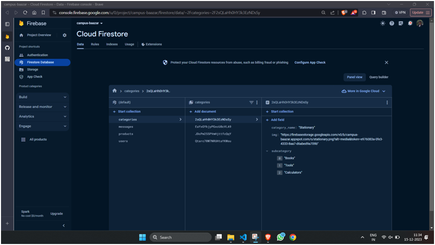</td> 
</tr>
</table>

<table>
<tr>
 <td></td>    
</tr>
</table>

<table>
<tr>
 <td>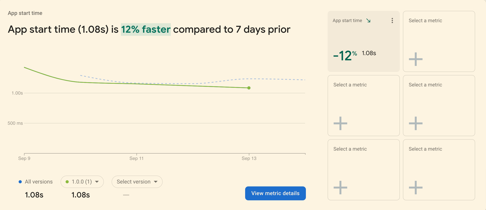</td>   
</tr>
</table>

## Mobile UI
<table style="padding:10px">
  <tr>
    <td>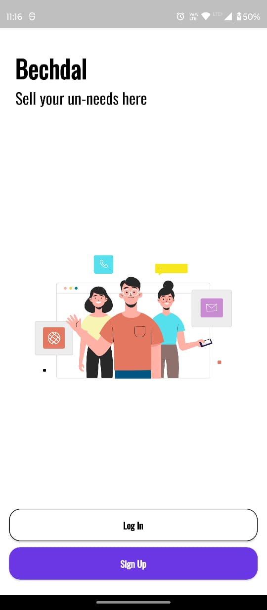</td>   
    <td>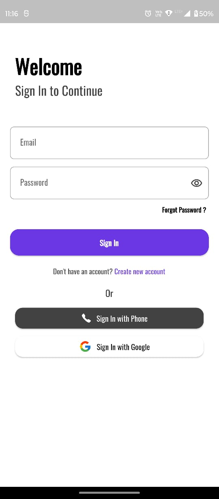</td>
    <td>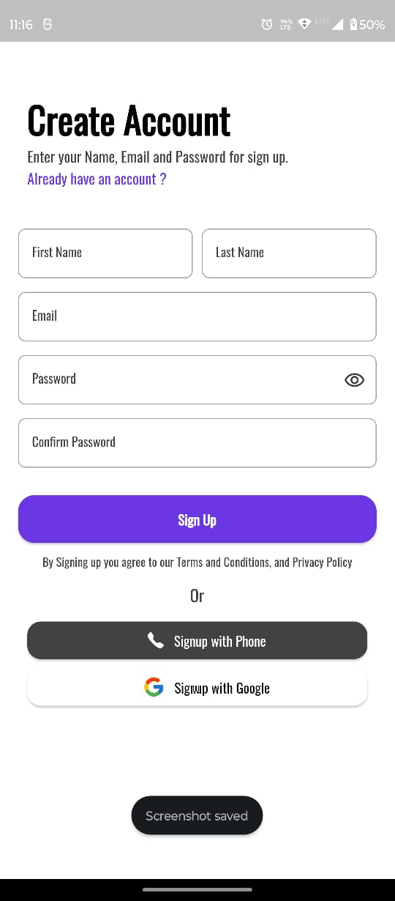</td> 
  </tr>
 </table>
 <table>
  <tr>
    <td>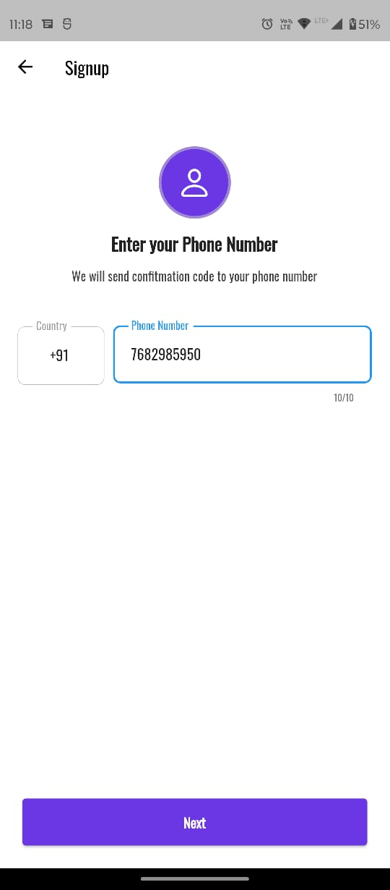</td>   
    <td>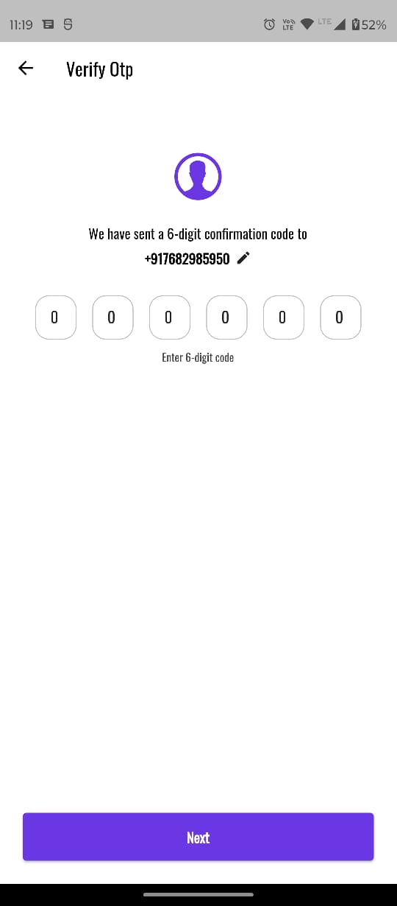</td>
    <td></td>  
  </tr>
  </table>
 <table>
  <tr>
   <td>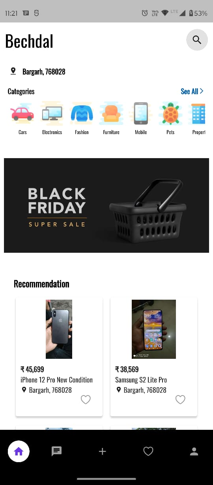</td> 
    <td>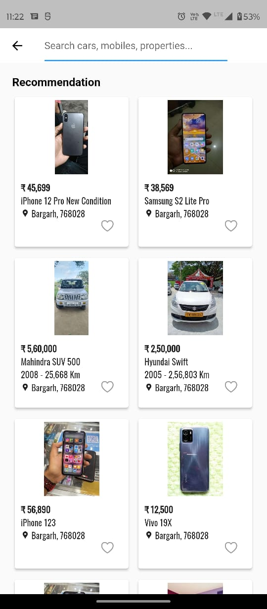</td>
    <td>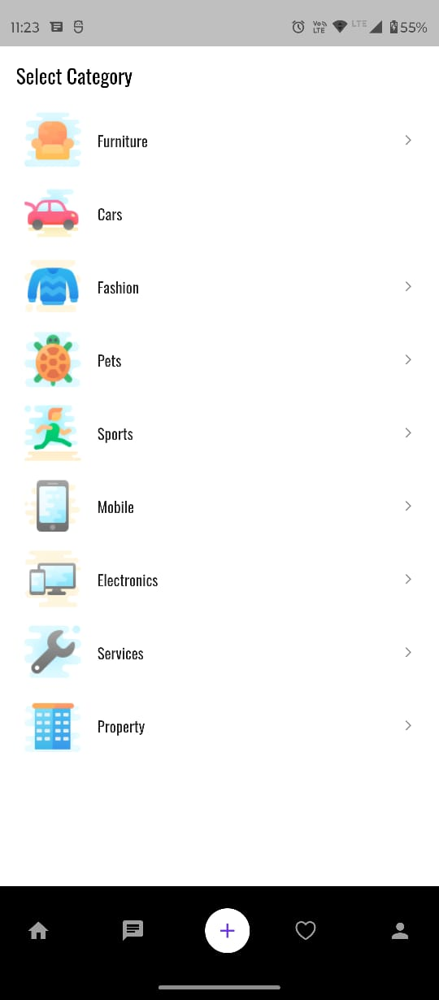</td> 
     
  </tr>
  </table>
 <table>
  <tr>
  <td>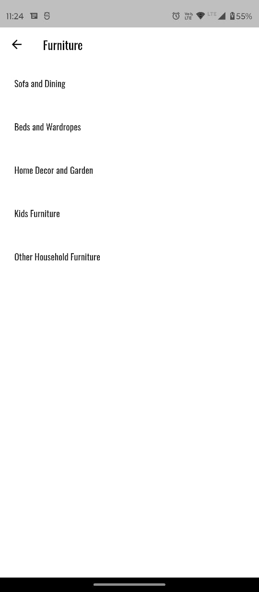</td>   
    <td>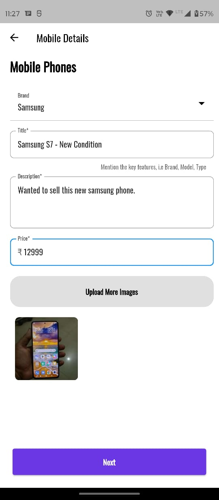</td>
    <td>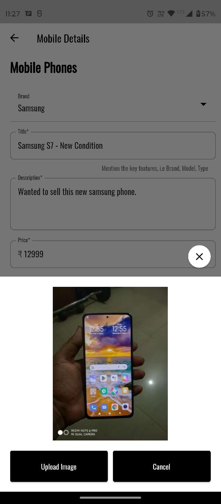</td> 
  </tr>
  </table>
  <table>
  <tr>
   <td>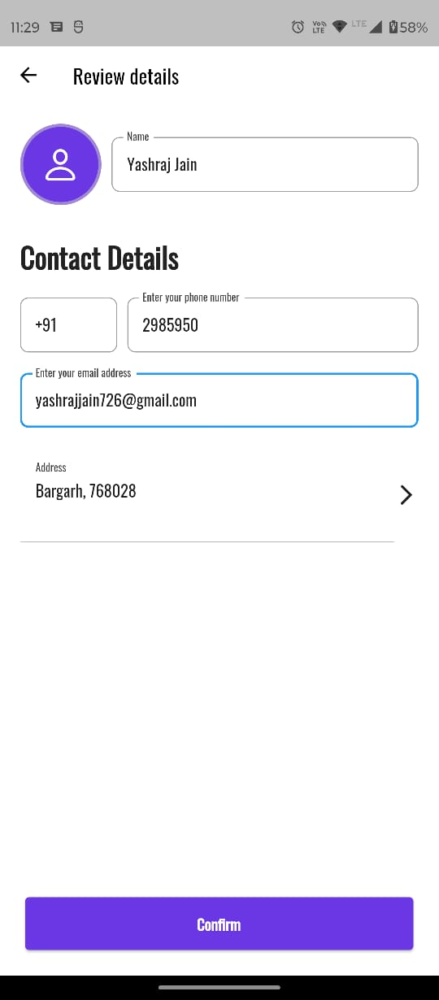</td>   
    <td>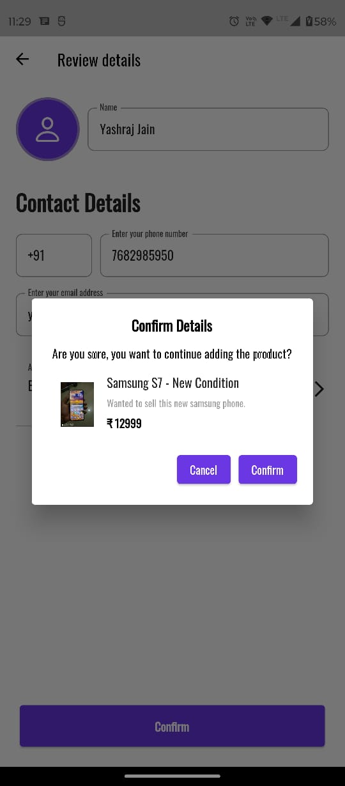</td>
    <td>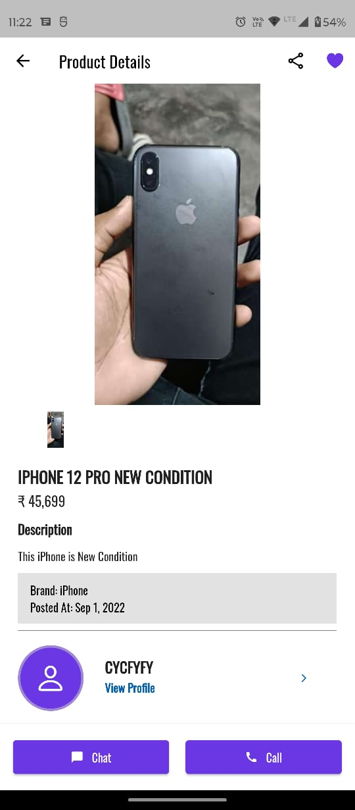</td> 
  </tr>
  </table>
 <table>
  <tr>
   <td>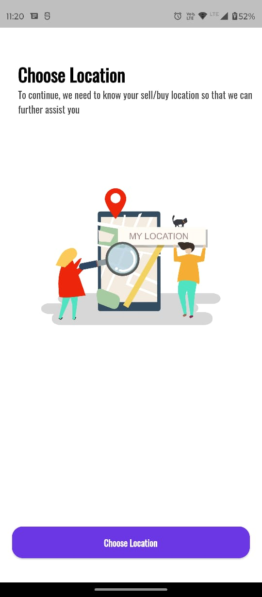</td>   
    <td>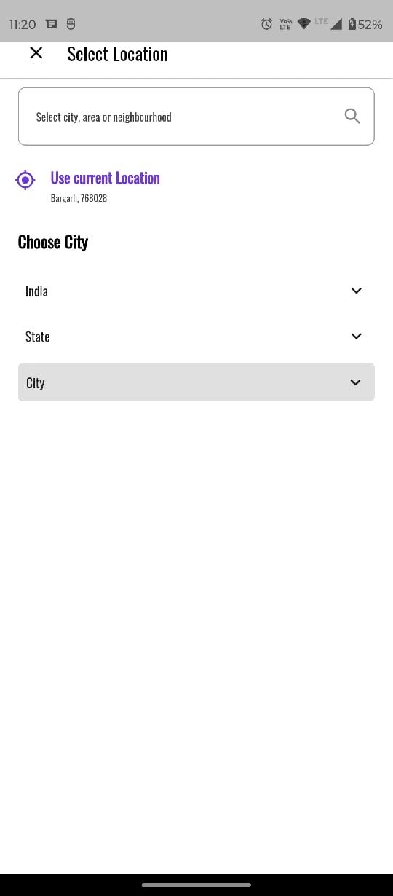</td>
    <td>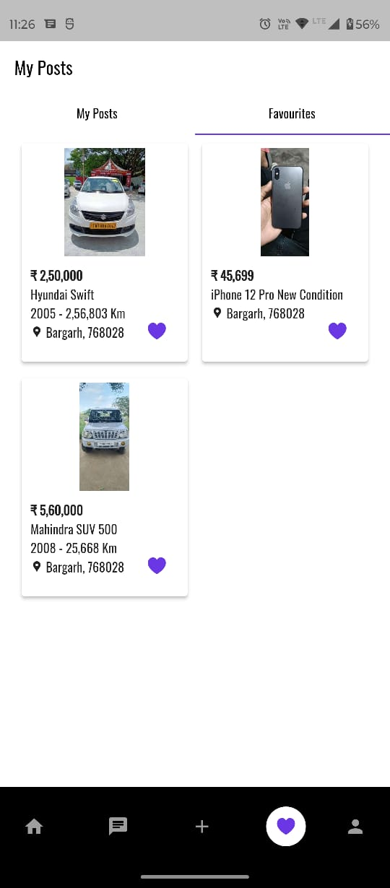</td>
  </tr>
  </table>
  <table>
  <tr>
   <td>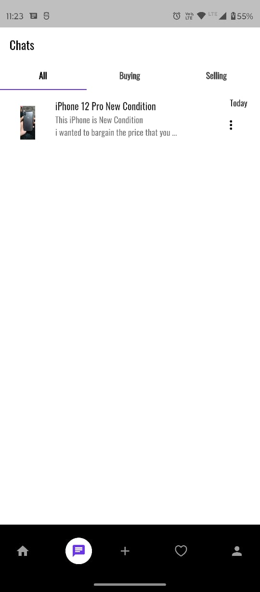</td>   
    <td>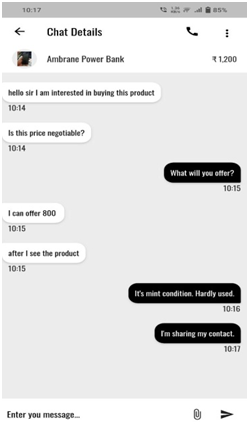</td>
  </tr>
  </table>

